# UNIVERSIDAD DE SAN CARLOS DE GUATEMALA  
## FACULTAD DE INGENIERÍA  
### ESCUELA DE CIENCIAS Y SISTEMAS  
  

---

<p align="center">
  
</p>

<h1 align="center">Manual Técnico: Control de Versiones con Git y GitHub</h1>


---

## Glosario de Términos Clave

Antes de iniciar, es fundamental comprender los conceptos básicos del versionamiento:

* **Repositorio (Repo):** Contenedor digital donde se almacena el proyecto y todo su historial de cambios.
* **Commit:** "Fotografía" del estado de tus archivos en un momento dado. Incluye un mensaje descriptivo y un ID único.
* **Rama (Branch):** Línea de tiempo independiente de desarrollo. La principal se denomina `main`.
* **Remote (Remoto):** Versión del proyecto alojada en un servidor en la nube (GitHub).
* **Clone:** Descargar una copia exacta de un repositorio remoto a tu computadora local.
* **Push:** Acción de subir tus commits locales al repositorio remoto.
* **Pull:** Acción de descargar los últimos cambios del remoto para actualizar tu copia local.
* **.gitignore:** Archivo especial donde se enlistan carpetas o archivos que Git **no** debe rastrear (ej. contraseñas o librerías pesadas).


---


##  OBJETIVOS

1.  Configurar el entorno local para el uso de Git.
2.  Aprender a vincular proyectos locales con repositorios remotos en GitHub.
3.  Dominar el flujo de trabajo básico (Add, Commit, Push).


---

## Utilizando la Versión De Consola (Terminal)

###  Configuración Inicial 
1. Al ser la primerza vez que utilizamos git necesitamos configurar el usuario (solo la primera vez). Utilizamos los comandos:
```bash
git config --global user.name "Tu Usuario"
git config --global user.email "Tu Correo"
```

<p align="center">
  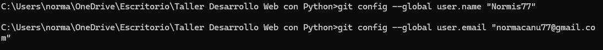
</p>

### Creación de un repositorio local
1. Creamos de manera local la carpeta que necesitamos subir al repositorio.

2. En el cmd nos ubicamos en esta carpeta mediante el comando: 

```bash
cd "ruta/de/tu/carpeta"
```

<p align="center">
  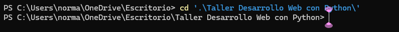
</p>

3. Convertimos la carpeta en un repositorio local con el comando:
```bash
git init
```
<p align="center">
  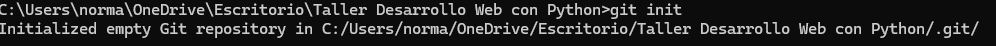
</p>
Nótese que se creará una carpeta .git que se encargará de rastrear los cambios.


### Creación de un repositorio en línea
1. En nuestra cuenta de github nos dirigimos al símblo de + y elegimos "Crear un nuevo repositorio":
<p align="center">
  
</p>

2. Le brindamos un nombre y configuramos nuestro repositorio:
Importante: En cuando a la visibilidad
- Público: De acceso Global, todo el mundo puede ver tu código.
- Privado: Solo el usuario tiene acceso y sus invitados.

<p align="center">
  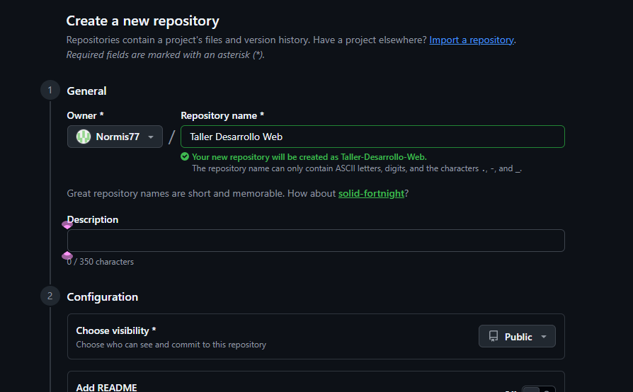
</p>

3. Creamos el Repositorio 
Nivel 3
<p align="center">
  
</p>

Repositorio Creado:
<p align="center">
  
</p>

Incluso github da indicaciones de cómo continuar
<p align="center">
  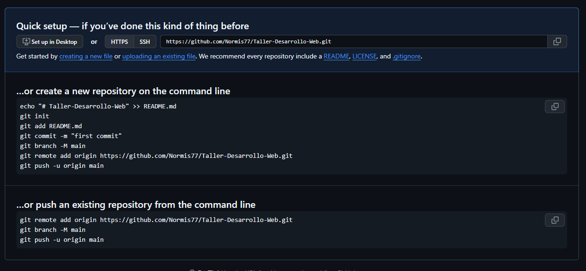
</p>

### Conexión Local y Remoto
1. En nuestro caso es la segunda opción, por lo tanto, utilizamos el comando siguiente para realizar la conexión entre el repositorio local y el remoto:

```bash
git remote add origin link_del_repositorio
```
<p align="center">
  
</p>

2. Creamos un rama Principal y la renombramos con el comando

```bash
git branch -M main
```
<p align="center">
  
</p>

3. Añadimos el contenido/cambios al repositorio con el comando:
 ```bash
git add .
```
<p align="center">
  
</p>

4. Creamos el primer commit con el comando:
 ```bash
git commit -m "Descripción del Cambio"
```
<p align="center">
  
</p>

5. Subimos los cambios al repositorio local con el comando(cuando es el primer commit):

 ```bash
git push -u origin main
```
<p align="center">
  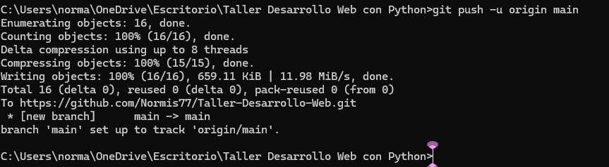
</p>

Cuando ya se hizo el primer commit podemos simplemente usar:
 ```bash
git push 
```


### Clonar un Repositorio Existente
Si el repositorio ya está en GitHub y quieres bajarlo a tu PC por primera vez:

Siempre en la carpeta donde queremos tener el proyecto utilizamos el comando:
 ```bash
git clone "link_del_repositorio" 
```


## Comandos importantes de conocer:
1. Git status 
Revisa qué archivos han cambiado y qué falta por guardar.
 ```bash
git status
```
2. Git branch 
Sirve para ver las ramas que tengo en mi repositorio y en cuál estoy.
 ```bash
git branch
```
3. Git checkout 
Crea una nueva rama y se cambia a ella automáticamente.
 ```bash
git checkout -b nombre_de_rama
```
4. Git clone 	
Descarga un proyecto completo de GitHub a tu PC.
 ```bash
git clone [url]
```

4. Git pull 	
Trae los cambios del remoto al repositorio local
 ```bash
git pull
```

## Creación de un Repositorio desde GitHub Desktop

### Creación de un Repositorio
1. En la pestaña File podemos crear un nuevo repositorio
<p align="center">
  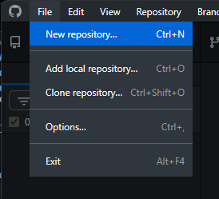
</p>

2. Asignamos un nombre y elegimos la dirección local de dónde crearemos el repositorio local
<p align="center">
  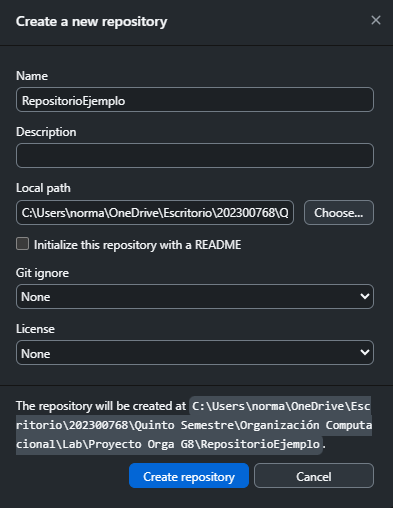
</p>
<p align="center">
  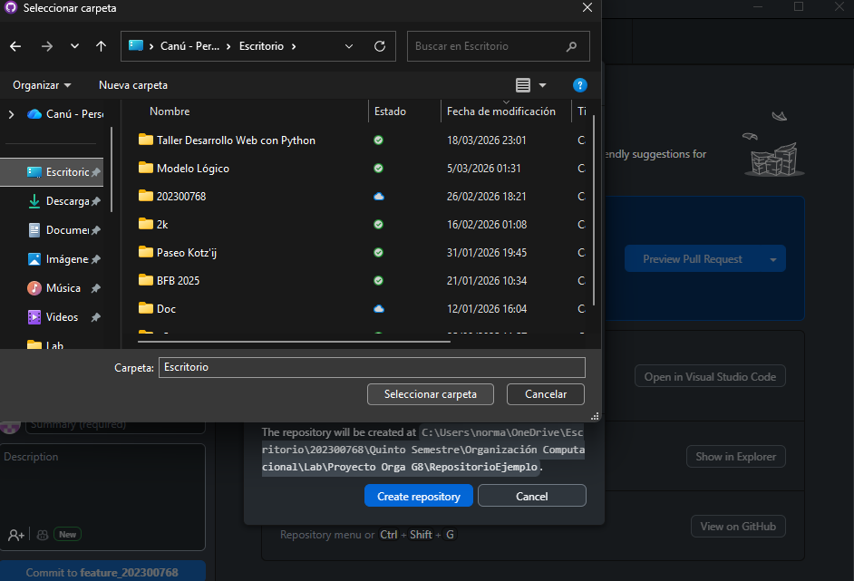
</p>

3. Al crear el repositorio notemos que se crea una rama main y además nos pide publicar el repositorio, es decir, nuestro repositorio aún solo es local.
<p align="center">
  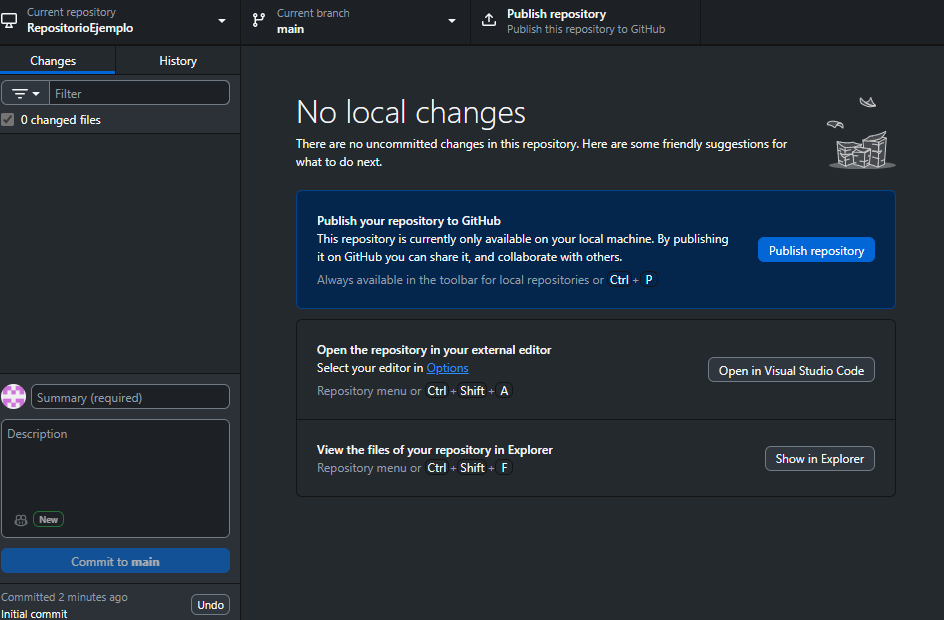
</p>

4. Al intentar publicar el repositorio necesitamos elegir el tipo de privacidad del repositorio, dependiendo de lo que necesitemos seleccionamos.
<p align="center">
  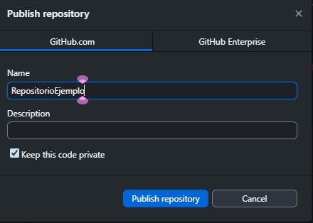
</p>

5. Podemos visualizar el repostiorio local simplemente presionando "view on GitHub"
<p align="center">
  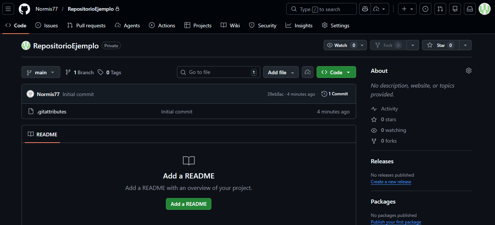
</p>

6. Para hacer un commit a este repositorio visualizaremos los cambios el el dashboard.
<p align="center">
  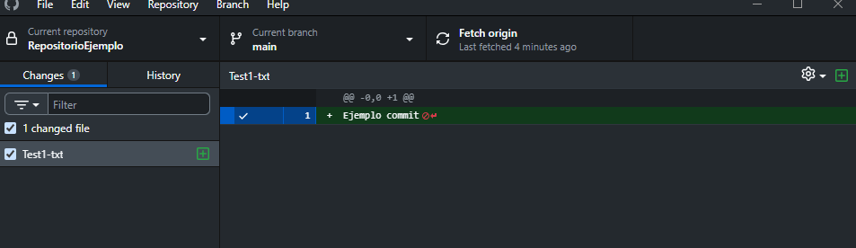
</p>

7. Para hacer el commit nos dirigimos a la esquina inferior izquierda y llenamos los datos, notemos que incluso nos da sugerencias del nombre a asignar al commit y la descripción.
<p align="center">
  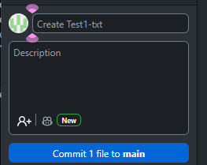
</p>

8. Al realizar el commit automáticamente nos pide realizar el push, para poder ver reflejado el cambio en el repositorio remoto.
<p align="center">
  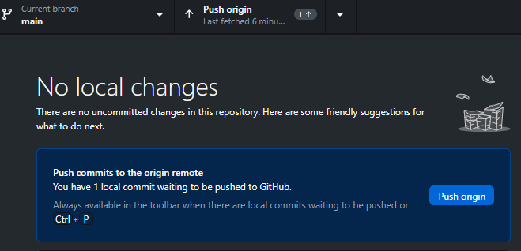
</p>

9. Después de hacer el push, podemos ver los cambios reflejados en el repositorio remoto.
<p align="center">
  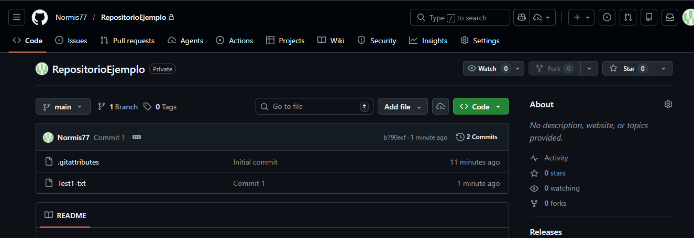
</p>


##  Flujo de Trabajo Resumido
```
Modificar archivos
       ↓
   git add .
       ↓
git commit -m "descripción"
       ↓
    git push
       ↓
Cambios reflejados en GitHub 
```