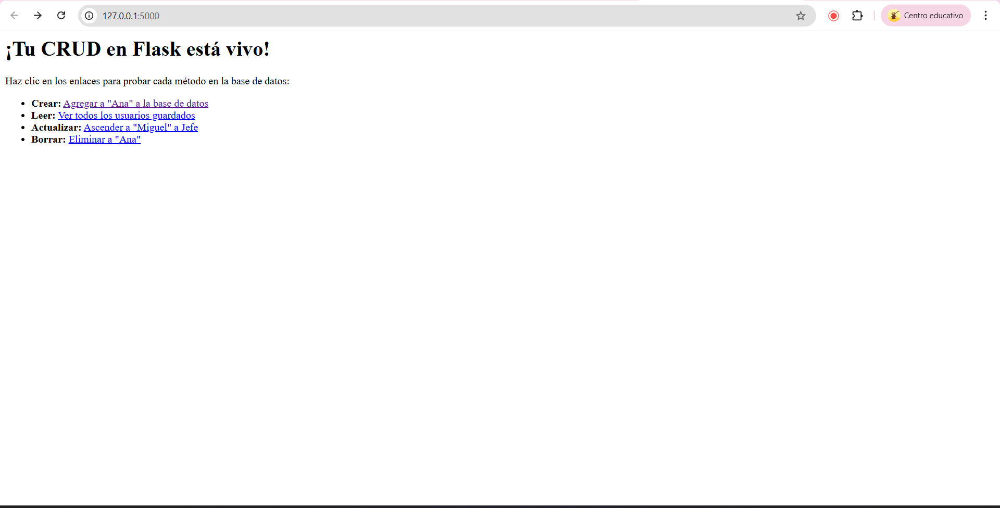
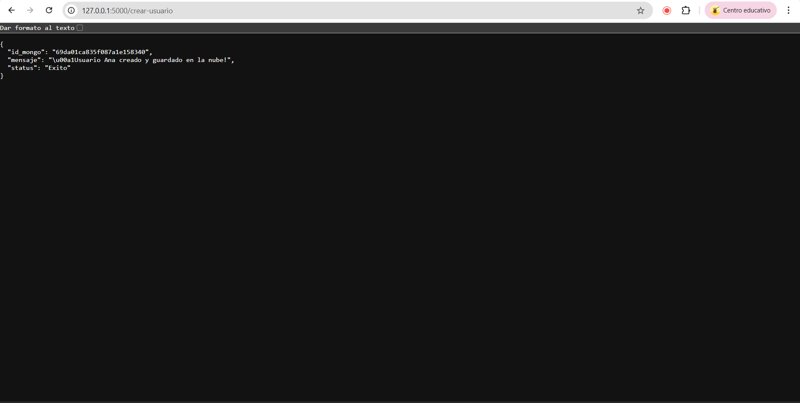
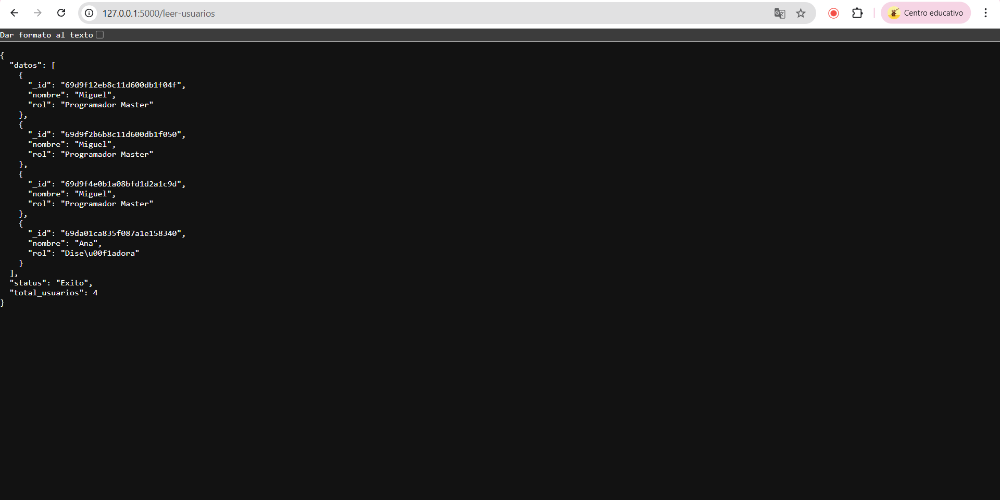
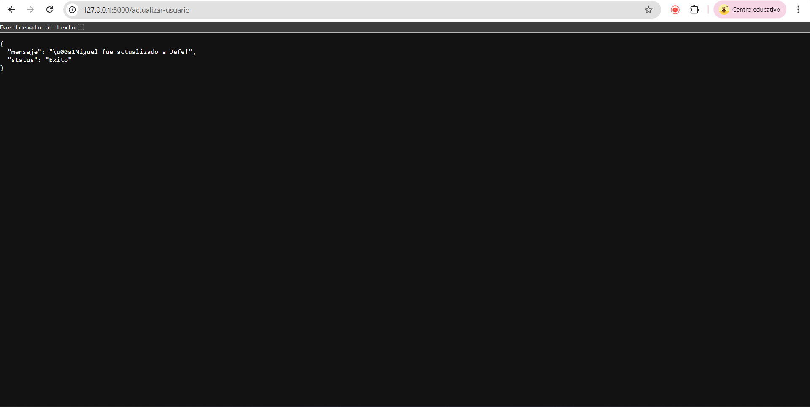
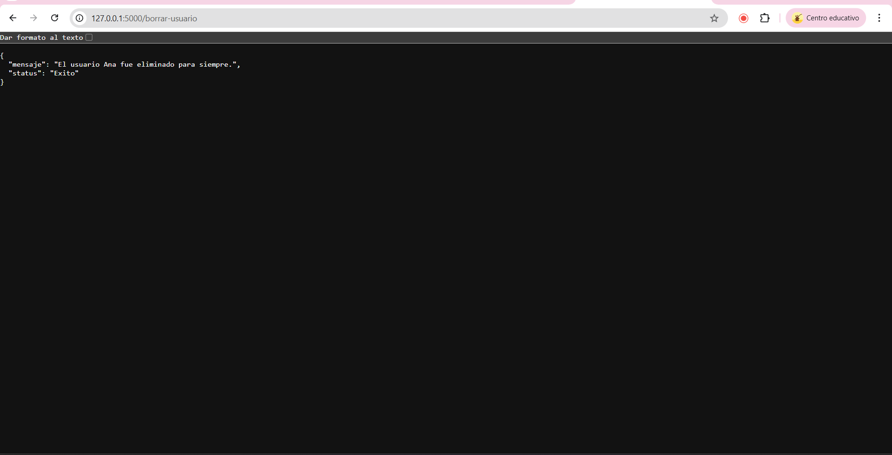
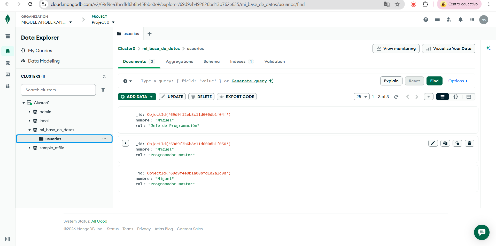

> **Prerequisito:** Esta guía asume que ya tienes tu entorno virtual activo, las librerías instaladas (`flask`, `pymongo`, `python-dotenv`) y tu cluster en MongoDB Atlas funcionando con tu archivo `.env` listo. Si aún no tienes eso, revisa primero la guía anterior.

---

##  Antes de empezar: ¿Cómo se traduce lo que ya sabes?

Si vienes de SQL u otras bases de datos, ya conoces las 4 operaciones fundamentales. En MongoDB y Flask se escriben diferente, pero el concepto es exactamente el mismo:

| Lo que conoces | En SQL | En MongoDB (pymongo) | Qué hace |
|---|---|---|---|
| **CREATE** | `INSERT INTO` | `insert_one({})` | Crea un nuevo registro |
| **READ** | `SELECT * FROM` | `find()` | Lee registros |
| **UPDATE** | `UPDATE ... SET` | `update_one(filtro, {"$set": {}})` | Modifica un registro |
| **DELETE** | `DELETE FROM` | `delete_one({})` | Elimina un registro |

### ¿Y los métodos HTTP?

Normalmente un CRUD "correcto" usa `POST`, `GET`, `PUT` y `DELETE`. En esta guía **simplificamos todo a `GET`** para poder probarlo directo desde el navegador sin necesidad de herramientas extra como Postman. En proyectos reales, cada operación usaría su método correspondiente.

| Operación | Método HTTP "correcto" | Lo que usamos aquí | ¿Por qué? |
|---|---|---|---|
| Crear | `POST` | `GET` | Para probar desde el navegador |
| Leer | `GET` | `GET` |  Es el correcto |
| Actualizar | `PUT` / `PATCH` | `GET` | Para probar desde el navegador |
| Eliminar | `DELETE` | `GET` | Para probar desde el navegador |

---

##  El archivo `app.py` completo

Actualiza tu `app.py` con el siguiente código. Después explicamos cada parte:

```python
import os
from flask import Flask, jsonify
from pymongo import MongoClient
from dotenv import load_dotenv

# Cargamos las variables del archivo .env
load_dotenv()

app = Flask(__name__)

MONGO_URI = os.getenv("MONGO_URI")

try:
    client = MongoClient(MONGO_URI)
    db = client['mi_base_de_datos']
    usuarios_coleccion = db['usuarios']
    print("¡Conexión exitosa a MongoDB Atlas!")
except Exception as e:
    print(f"Error al conectar: {e}")


# --- MENÚ PRINCIPAL ---

@app.route('/')
def inicio():
    return """
    <h1>¡Tu CRUD en Flask está vivo!</h1>
    <p>Haz clic en los enlaces para probar cada método en la base de datos:</p>
    <ul>
        <li><b>Crear:</b> <a href='/crear-usuario'>Agregar a "Ana" a la base de datos</a></li>
        <li><b>Leer:</b> <a href='/leer-usuarios'>Ver todos los usuarios guardados</a></li>
        <li><b>Actualizar:</b> <a href='/actualizar-usuario'>Ascender a "Miguel" a Jefe</a></li>
        <li><b>Borrar:</b> <a href='/borrar-usuario'>Eliminar a "Ana"</a></li>
    </ul>
    """


# CREATE
@app.route('/crear-usuario')
def crear_usuario():
    try:
        nuevo_usuario = {"nombre": "Ana", "rol": "Diseñadora"}
        resultado = usuarios_coleccion.insert_one(nuevo_usuario)
        return jsonify({
            "status": "Exito",
            "mensaje": "¡Usuario Ana creado y guardado en la nube!",
            "id_mongo": str(resultado.inserted_id)
        })
    except Exception as e:
        return jsonify({"status": "Error", "detalle": str(e)}), 500


# READ
@app.route('/leer-usuarios')
def leer_usuarios():
    try:
        usuarios_cursor = usuarios_coleccion.find()
        lista_usuarios = []
        for usuario in usuarios_cursor:
            usuario['_id'] = str(usuario['_id'])
            lista_usuarios.append(usuario)
        return jsonify({
            "status": "Exito",
            "total_usuarios": len(lista_usuarios),
            "datos": lista_usuarios
        })
    except Exception as e:
        return jsonify({"status": "Error", "detalle": str(e)}), 500


# UPDATE
@app.route('/actualizar-usuario')
def actualizar_usuario():
    try:
        filtro = {"nombre": "Miguel"}
        nuevos_datos = {"$set": {"rol": "Jefe de Programación"}}
        resultado = usuarios_coleccion.update_one(filtro, nuevos_datos)
        if resultado.modified_count > 0:
            return jsonify({"status": "Exito", "mensaje": "¡Miguel fue actualizado a Jefe!"})
        else:
            return jsonify({"status": "Aviso", "mensaje": "No se hicieron cambios."})
    except Exception as e:
        return jsonify({"status": "Error", "detalle": str(e)}), 500


# DELETE
@app.route('/borrar-usuario')
def borrar_usuario():
    try:
        resultado = usuarios_coleccion.delete_one({"nombre": "Ana"})
        if resultado.deleted_count > 0:
            return jsonify({"status": "Exito", "mensaje": "El usuario Ana fue eliminado para siempre."})
        else:
            return jsonify({"status": "Aviso", "mensaje": "No se encontró a Ana para borrarla."})
    except Exception as e:
        return jsonify({"status": "Error", "detalle": str(e)}), 500


if __name__ == '__main__':
    app.run(debug=True)
```

---

##  PASO A PASO — Probando cada operación

Enciende el servidor con `python app.py` y abre `http://127.0.0.1:5000` en el navegador. Verás el menú con los cuatro enlaces.



---

### CREATE — `insert_one()`

**Visita:** `http://127.0.0.1:5000/crear-usuario`

```python
nuevo_usuario = {"nombre": "Ana", "rol": "Diseñadora"}
resultado = usuarios_coleccion.insert_one(nuevo_usuario)
```

**¿Qué hace `insert_one()`?**
Recibe un diccionario de Python (equivalente a un objeto JSON) y lo guarda como un nuevo **documento** en la colección. MongoDB le asigna automáticamente un `_id` único, que es el equivalente al `PRIMARY KEY` autoincremental de SQL.

**Respuesta esperada:**



El campo `id_mongo` en la respuesta es el identificador único que MongoDB asignó al nuevo documento.

---

###  READ — `find()`

**Visita:** `http://127.0.0.1:5000/leer-usuarios`

```python
usuarios_cursor = usuarios_coleccion.find()
lista_usuarios = []
for usuario in usuarios_cursor:
    usuario['_id'] = str(usuario['_id'])  
    lista_usuarios.append(usuario)
```

**¿Qué hace `find()`?**
Sin argumentos, devuelve **todos** los documentos de la colección (equivale a `SELECT * FROM usuarios`). Devuelve un **cursor**, que es como un iterador: hay que recorrerlo con un `for` para convertirlo en lista.

>  **¿Por qué `str(usuario['_id'])`?** El `_id` de MongoDB es un objeto especial de tipo `ObjectId`, no un texto plano. `jsonify()` no sabe cómo convertirlo, por eso hay que transformarlo a `str` antes de enviarlo.

**Respuesta esperada:**



Verás todos los documentos guardados hasta ahora, incluyendo los de la guía anterior y el nuevo de Ana.

---

### UPDATE — `update_one(filtro, {"$set": {}})`

**Visita:** `http://127.0.0.1:5000/actualizar-usuario`

```python
filtro      = {"nombre": "Miguel"}
nuevos_datos = {"$set": {"rol": "Jefe de Programación"}}
resultado = usuarios_coleccion.update_one(filtro, nuevos_datos)
```

**¿Qué hace `update_one()`?**
Recibe **dos argumentos**:
1. El **filtro**: qué documento quieres modificar (como el `WHERE` en SQL).
2. Los **nuevos datos**: qué campos cambiar, usando el operador `$set`.

>  **¿Por qué `$set`?** En MongoDB, los operadores de modificación llevan `$` al inicio. Si no usas `$set` y pasas el documento directamente, MongoDB **reemplaza** el documento completo en lugar de solo actualizar el campo indicado. `$set` es la forma segura de modificar campos específicos sin tocar el resto.

`update_one()` modifica solo el **primer** documento que coincida con el filtro. Si quieres actualizar todos los que coincidan, usa `update_many()`.

**Respuesta esperada:**



---

### DELETE — `delete_one()`

**Visita:** `http://127.0.0.1:5000/borrar-usuario`

```python
resultado = usuarios_coleccion.delete_one({"nombre": "Ana"})
if resultado.deleted_count > 0:
    # Se borró algo
```

**¿Qué hace `delete_one()`?**
Recibe un filtro y elimina el **primer** documento que coincida. El objeto `resultado` tiene una propiedad `deleted_count` que indica cuántos documentos fueron eliminados (0 si no encontró nada, 1 si borró uno). Siempre es buena práctica verificarlo para dar una respuesta útil al usuario.

Al igual que `update_one()`, existe `delete_many()` para eliminar todos los documentos que coincidan con el filtro.

**Respuesta esperada:**



---

###  Verificar en MongoDB Atlas

Después de ejecutar las operaciones, puedes ir al **Data Explorer** de Atlas y ver cómo quedó tu colección. Notarás que Miguel ahora tiene `rol: "Jefe de Programación"` y que Ana ya no aparece.



---

## Resumen de métodos de pymongo

| Operación | Método | Equivalente SQL |
|---|---|---|
| Crear uno | `insert_one({doc})` | `INSERT INTO tabla VALUES (...)` |
| Crear varios | `insert_many([doc1, doc2])` | `INSERT INTO tabla VALUES (...), (...)` |
| Leer todos | `find()` | `SELECT * FROM tabla` |
| Leer con filtro | `find({"campo": "valor"})` | `SELECT * FROM tabla WHERE campo = 'valor'` |
| Leer uno | `find_one({"campo": "valor"})` | `SELECT * FROM tabla WHERE ... LIMIT 1` |
| Actualizar uno | `update_one(filtro, {"$set": {}})` | `UPDATE tabla SET campo = valor WHERE ...` |
| Actualizar varios | `update_many(filtro, {"$set": {}})` | `UPDATE tabla SET ... WHERE ...` (sin LIMIT) |
| Borrar uno | `delete_one(filtro)` | `DELETE FROM tabla WHERE ... LIMIT 1` |
| Borrar varios | `delete_many(filtro)` | `DELETE FROM tabla WHERE ...` |

---
