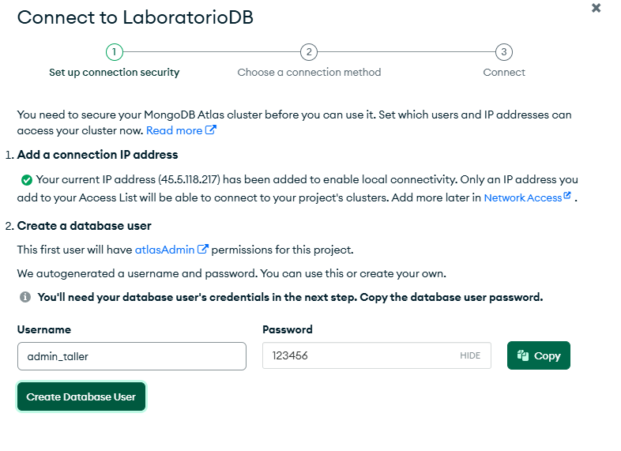
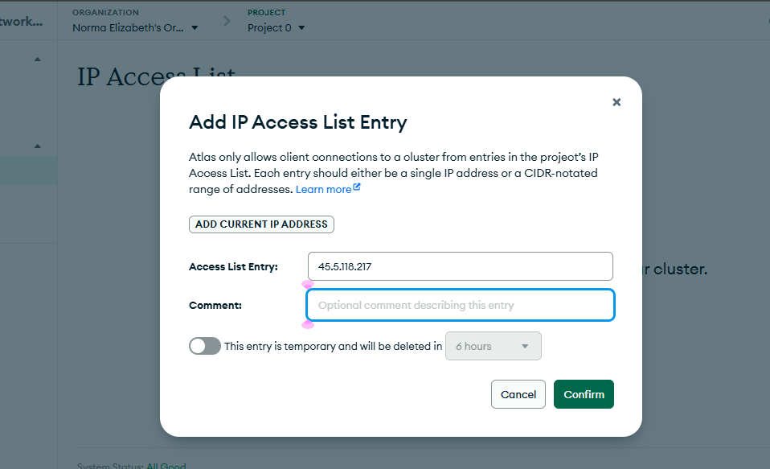
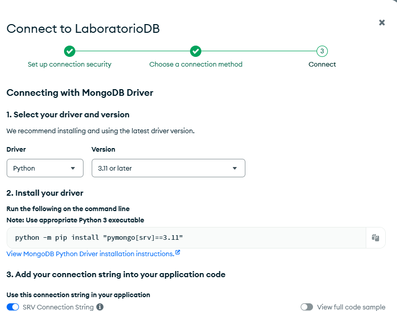
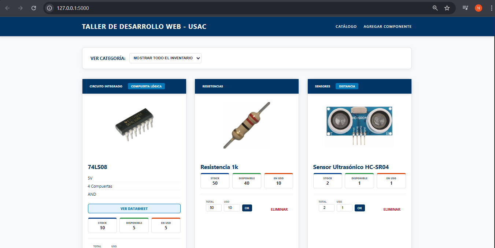
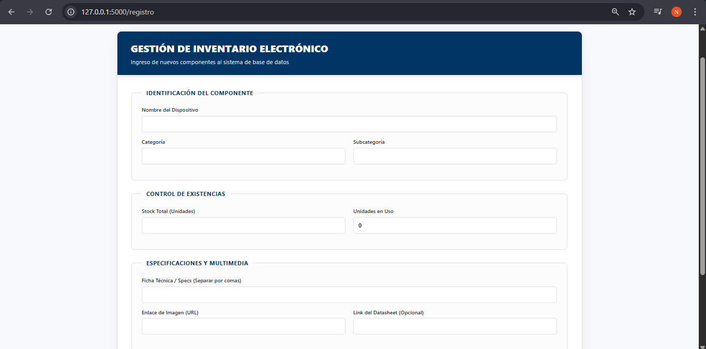

# UNIVERSIDAD DE SAN CARLOS DE GUATEMALA  
## FACULTAD DE INGENIERÍA  
### ESCUELA DE CIENCIAS Y SISTEMAS  
  

---

<p align="center">
  
</p>

<h1 align="center">ElectroStock 1.0</h1>
<h2 align="center">Manual Técnico: Proyecto de Implementación</h2>

---

## Problema a Resolver

En la carrera de ingeniería, adquirimos diversos componentes para distintos laboratorios; sin embargo, es común perder el control del stock disponible de sensores, integrados o actuadores.

**Objetivo:** Desarrollar una aplicación web integral para la gestión de inventario, permitiendo registrar componentes, monitorear existencias en tiempo real, actualizar cantidades y gestionar la eliminación de registros obsoletos.

## Estructura de Datos (Esquema)
Para cada componente almacenaremos:
* **Nombre:** Identificador del dispositivo.
* **Categoría y Subcategoría:** Clasificación técnica.
* **Stock:** Control de unidades totales, en uso y disponibles.
* **Multimedia:** Enlace a imagen y Datasheet (opcional).

--- 

## Paso 1: Configuración en la Nube (MongoDB Atlas)
Antes de programar, configuraremos la base de datos NoSQL donde residirá la información.

### 1. Creación del Cluster (El Servidor)
* En el panel de MongoDB Atlas, haz clic en **"Create"**.
* **Selecciona el Plan:** Elige la opción **"M0" (FREE)** para obtener un clúster gratuito.
* **Proveedor y Región:** Mantén las opciones por defecto (usualmente AWS / Virginia).
* Haz clic en **"Create Deployment"**.

### 2. Configuración de Seguridad 
Para permitir la conexión desde nuestra aplicación Flask, configuramos los accesos:

**A. Usuario y Contraseña:**
* Crea un usuario (ej: `admin_taller`).
* Genera una contraseña segura y **guárdala inmediatamente**; será indispensable para el código Python.
* Haz clic en **"Create Database User"**.

**B. IP Access List (Acceso Universal):**
* En el menú izquierdo, ve a **Security** > **Network Access**.
* Haz clic en **"Add IP Address"**.
* Selecciona la opción **"Allow Access from Anywhere"** (esto agregará la IP `0.0.0.0/0`).
* Confirma con **"Confirm"**.

<p align="center">
  
</p>
<p align="center">
  
</p>
### 3. Obtener la Llave de Conexión (Connection String)
* Regresa a **Deployment** > **Database**.
* Haz clic en el botón **"Connect"**.
* Selecciona la opción **"Drivers"**.
* Asegúrate de que el lenguaje sea **Python** y la versión **3.11 or later**.
* Copia la cadena de conexión. Se verá similar a esto:
  `mongodb+srv://tu_usuario:<password>@tu_cluster.mongodb.net/?appName=LaboratorioDB`
* **IMPORTANTE:** Reemplaza `<password>` por la contraseña real que creaste en el paso anterior.
<p align="center">
  
</p>
---

## Paso 2: Configuración del Entorno Local

### 1. Instalar el Driver
Abre tu terminal o CMD y ejecuta el siguiente comando para instalar la librería que permite a Python comunicarse con MongoDB:

```bash
pip install "pymongo[srv]"
```

## Creamos nuestra Estructura
```bash
ProyectoFinal/
├── app.py
├── templates/
│   ├── base.html
|   ├── registro.html
│   └── catalogo.html
└── static/
    └── style.css
```

Despues de tener la estructura podemos copiar el código del repositorio proporcionado.
Ejecutamos con el comando 

```bash
 python app.py
```
## VISUALIZACIÓN INTERFAZ
<p align="center">
  
</p>
<p align="center">
  
</p>
