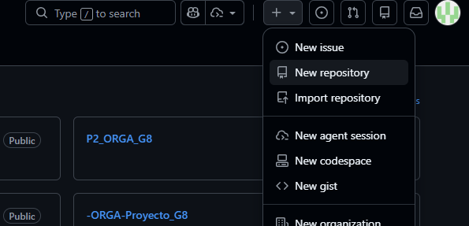
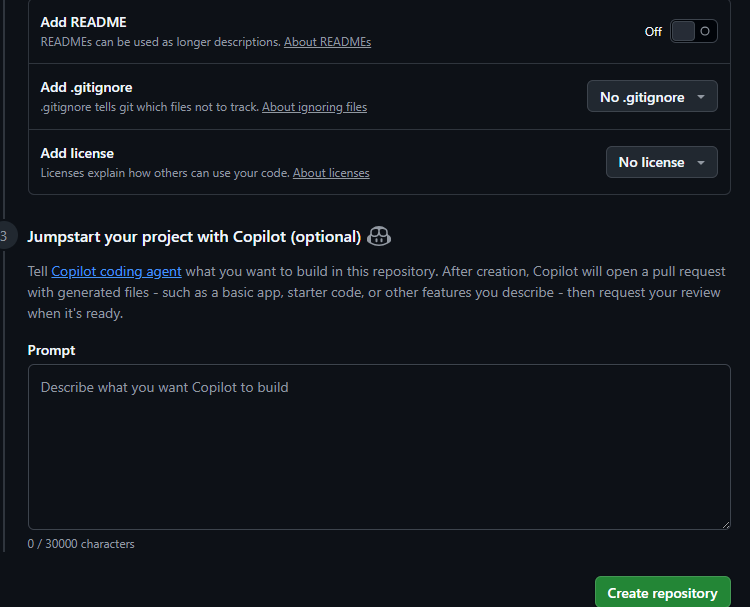
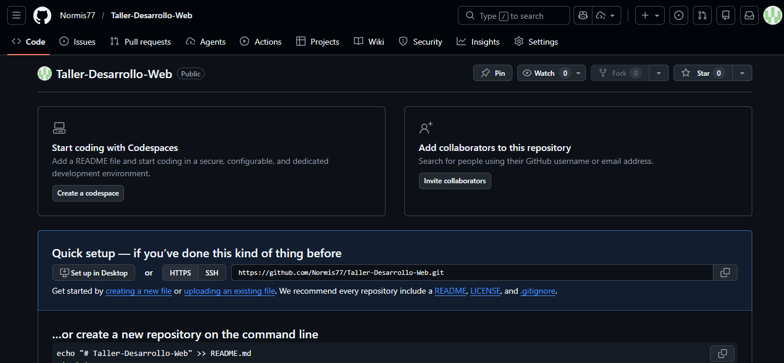
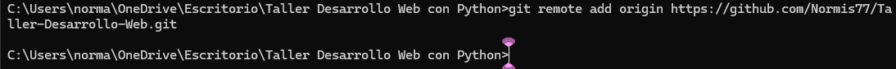
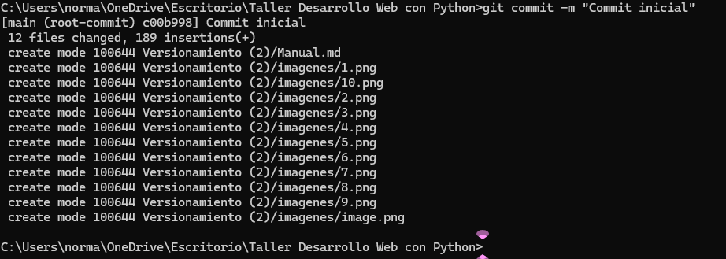

# UNIVERSIDAD DE SAN CARLOS DE GUATEMALA  
## FACULTAD DE INGENIERÍA  
### ESCUELA DE CIENCIAS Y SISTEMAS  
  

---

<p align="center">
  
</p>

<h1 align="center">Manual Técnico: Control de Versiones con Git y GitHub</h1>


---

## Glosario de Términos Clave

Antes de iniciar, es fundamental comprender los conceptos básicos del versionamiento:

* **Repositorio (Repo):** Es el "contenedor" o carpeta del proyecto donde Git guarda todo el historial de cambios.
* **Commit:** Es una "fotografía" de tus archivos en un momento exacto. Cada commit tiene un identificador único y un mensaje descriptivo.
* **Rama (Branch):** Es una línea de tiempo independiente. La rama principal suele llamarse `main`.
* **Remote (Remoto):** Es la versión de tu proyecto que vive en la nube (GitHub).
* **Clone:** Crear una copia local exacta de un repositorio que ya existe en GitHub.
* **Push:** Enviar tus cambios locales al repositorio en la nube.
* **Pull:** Traer los cambios más recientes de la nube a tu computadora.


---


##  OBJETIVOS

1.  Configurar el entorno local para el uso de Git.
2.  Aprender a vincular proyectos locales con repositorios remotos en GitHub.
3.  Dominar el flujo de trabajo básico (Add, Commit, Push).


---

## Utilizando la Versión De Consola

###  Configuración Inicial 
1. Al ser la primerza vez que utilizamos git necesitamos configurar el usuario (solo la primera vez). Utilizamos los comandos:
```bash
git config --global user.name "Tu Usuario"
git config --global user.email "Tu Correo"
```

<p align="center">
  
</p>

### Creación de un repositorio local
1. Creamos de manera local la carpeta que necesitamos subir al repositorio.

2. En el cmd nos ubicamos en esta carpeta mediante el comando: 

```bash
cd "ruta/de/tu/carpeta"
```

<p align="center">
  
</p>

3. Convertimos la carpeta en un repositorio local con el comando:
```bash
git init
```
<p align="center">
  
</p>
Nótese que se creará una carpeta .git que se encargará de rastrear los cambios.


### Creación de un repositorio en línea
1. En nuestra cuenta de github nos dirigimos al símblo de + y elegimos "Crear un nuevo repositorio":
<p align="center">
  
</p>

2. Le brindamos un nombre y configuramos nuestro repositorio:
Importante: En cuando a la visibilidad
- Público: De acceso Global, todo el mundo puede ver tu código.
- Privado: Solo el usuario tiene acceso y sus invitados.

<p align="center">
  
</p>

3. Creamos el Repositorio 
Nivel 3
<p align="center">
  
</p>

Repositorio Creado:
<p align="center">
  
</p>

Incluso github da indicaciones de cómo continuar
<p align="center">
  
</p>

### Conexión Local y Remoto
1. En nuestro caso es la segunda opción, por lo tanto, utilizamos el comando siguiente para realizar la conexión entre el repositorio local y el remoto:

```bash
git remote add origin link_del_repositorio
```
<p align="center">
  
</p>

2. Creamos un rama Principal y la renombramos con el comando

```bash
git branch -M main
```
<p align="center">
  
</p>

3. Añadimos el contenido/cambios al repositorio con el comando:
 ```bash
git add .
```
<p align="center">
  
</p>

4. Creamos el primer commit con el comando:
 ```bash
git commit -m "Descripción del Cambio"
```
<p align="center">
  
</p>

5. Subimos los cambios al repositorio local con el comando(cuando es el primer commit):

 ```bash
git push -u origin main
```
<p align="center">
  
</p>

Cuando ya se hizo el primer commit podemos simplemente usar:
 ```bash
git push 
```


### Clonar un Repositorio Existente
Si el repositorio ya está en GitHub y quieres bajarlo a tu PC por primera vez:

Siempre en la carpeta donde queremos tener el proyecto utilizamos el comando:
 ```bash
git clone "link_del_repositorio" 
```

## Utilizando la Versión Desktop

## Comandos importantes de conocer:
1. Git status 
Sirve para revisar el estado del repositorio.
 ```bash
git status
```
2. Git branch 
Sirve para ver las ramas que tengo en mi repositorio y en cuál estoy.
 ```bash
git branch
```
2. Git checkout "nombre_rama"
Sirve para salir de una rama y cambiar a otra
 ```bash
git checkout "rama"
```


# Creación de un Repositorio desde GitHub Desktop

